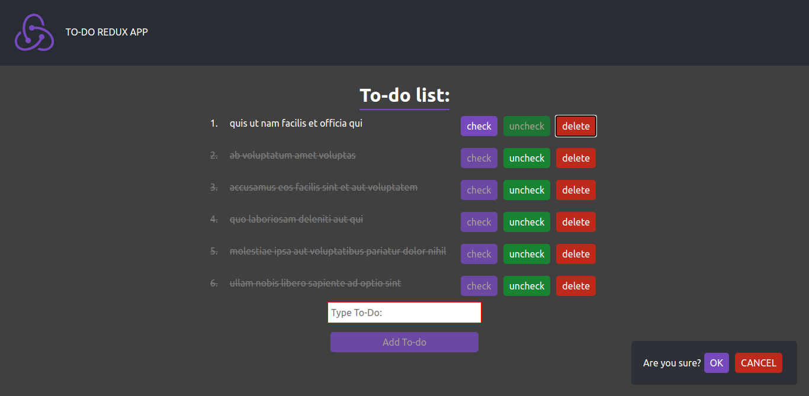

# To-do app with redux & TypeScript
- [To-do app with redux & TypeScript](#to-do-app-with-redux--typescript)
  - [Used](#used)
  - [Features](#features)
  - [Screenshots](#screenshots)

## Used
1. React
2. Redux
3. TypeScript
4. Redux thunk
5. Axios
6. React router

## Features
1. Api for fetch from jsonplayceholder
2. Loader component
3. PopUp component
4. React.lazy
5. Typed Redux actions with infer types from action creators: `type inferValueTypes<T> = T extends {[key:string]:infer U} ? U : never;`

## Screenshots

